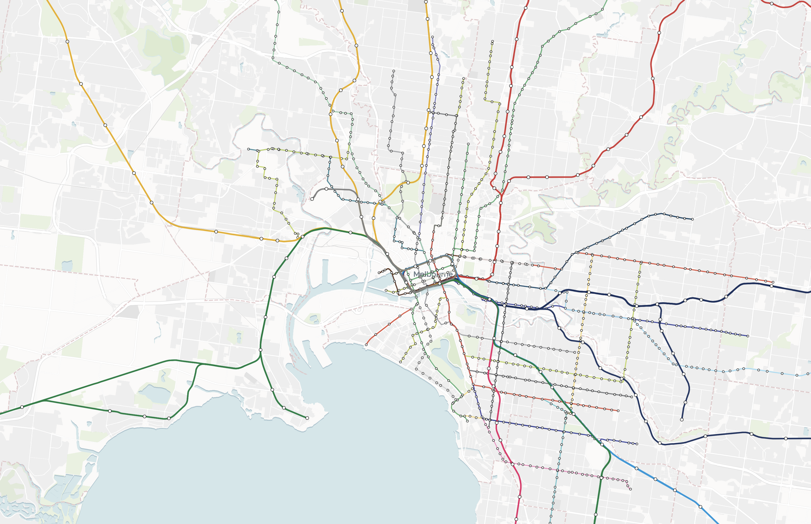

When I relocated to Melbourne last September, I found myself renting again for the first time in nearly a decade. One of the hardest parts of moving to a new country was having no intuitive sense of which neighbourhoods were considered good, up-and-coming, or best avoided.

I've now gone unconditional on a property, and it would feel like a waste not to share the data I collected and the analysis I carried out—especially if it can help others navigating the same journey.

## Where the Hell Do I Buy?

Even with helpful advice from colleagues, I found it difficult to make sense of it all—lacking the local knowledge to properly weigh their suggestions.

Melbourne proved to be a completely different experience from Auckland. The sheer scale and density of the city meant that just a few kilometres could translate to a 30-minute drive. While public transport here is significantly better than Auckland’s (which, to be fair, is almost non-existent), it has its own quirks.

Travel to and from the city centre is relatively straightforward, but commuting between nearby suburbs—especially those not directly connected to the CBD—can be surprisingly time-consuming. For example, cycling from Ascot Vale to Carlton North takes about 25 minutes, but the same trip by tram or train can take nearly an hour.

Amid the usual uncertainty of renting, I felt a growing need to find a more permanent home—somewhere that could offer my daughter a greater sense of long-term stability. I wanted to take a methodical approach, using a simple scoring system to evaluate properties at a glance and filter them from 'interesting' to both interesting _and_ viable.

## Finding & Getting the Data

That’s where I hit the first hurdle: while the data existed, it was often fragmented or hard to access. I had to do a fair bit of tinkering and reverse engineering to extract and consolidate it from various sources.

The goal was to build a cohesive view that brought together key livability and accessibility factors.

#### Notes

- All transport and cycling times are calculated to the ANZ Centre in Docklands and include walking time. If you work elsewhere, your mileage may vary—and some adjustments may be necessary.
- High-resolution images and source data are available in the appendix.

### Train & Tram Routes

The data was sourced from Public Transport Victoria’s interactive tools, which don’t offer bulk downloads but are relatively easy to reverse engineer for extracting spatial data. This included tram routes and stops, as well as train lines and station locations.

_**Key takeaway**: You'll want to be close to a train station or tram stop._



### Transit & Cycling Times to Docklands

This one was straightforward—Google is more than happy to provide this information for a fee.

To estimate realistic travel times, I generated a grid of approximately 15,000 sample points spaced at ~0.05 degrees across metropolitan Melbourne. Using the Google Routing API, I calculated public transport and cycling times from each point, targeting an arrival time of 8:30 AM on a Monday.

#### Public Transport

Unsurprisingly, shorter travel times correlate strongly with proximity to train and tram stations. Efficient routes matter more than geographic closeness. Suburbs like Williamstown and St Kilda—while not particularly central—benefit from direct, fast train lines.

_**Key takeaway**: Proximity to train or tram stations matters more than distance—efficient transport beats geographic closeness._


#### Cycling

While Google Maps isn’t perfect at modelling cycling routes—particularly when it comes to elevation or actual bike lanes—it was accurate enough to give a rough sense of travel times.

Unlike public transport, cycling times behave predictably: the further you are, the longer it takes.

_**Key takeaway**: Distance matters—no shortcuts on a bike._


### Public School Zoning & Performance

Private schooling is far more common in Melbourne than I’m used to. However, since private schools don’t follow catchment zones, I excluded them and focused solely on public schools.

Zoning data was easy to access through [Find My School](https://www.findmyschool.vic.gov.au/). Property sites like domain.com.au likely use the same or similar datasets.

The more difficult task was assessing school performance. Most available rankings skew heavily toward private and Catholic schools. Fortunately, VCE performance data is [publicly available](https://www.vcaa.vic.edu.au/administration/school-administration/performance-senior-secondary/senior-secondary-completion-and-achievement-information), which allowed me to clean and match public school outcomes to their zones.

_**Key takeaway**: Better-performing public schools tend to be in the eastern suburbs._


### Suburb Affluence & Gentrification

As I settled into Melbourne, I kept hearing stories of suburbs that had become “nice” over the last decade—classic gentrification. The problem was, I had no personal context to assess these claims. I didn’t know what these places used to be like.

This is where census data from the ABS came in handy. While not available in bulk at the postcode (POA) level, summary data was readily accessible through their portal and simple enough to scrape.

#### Median Household Income

The census data confirmed what many locals had told me: wealth is largely concentrated in the eastern suburbs. I didn’t scrape real estate listings, but casual observation suggests that higher income aligns with higher property prices. For scoring purposes, that made these areas less attractive—they were simply too competitive.

The ideal is finding suburbs that weren’t historically affluent but have shown clear upward trends—strong signals of ongoing gentrification.

_**Key takeaway**: Affluence is concentrated in the east, and it often comes with a premium._


#### Gentrification (2016–2021)

I focused on changes in median monthly household income between the 2016 and 2021 censuses.

As expected, already-affluent suburbs showed little movement. But inner-north and inner-west suburbs—like Yarraville, Kingsville, West Footscray, and Brunswick—saw noticeable income growth. The data backed up what I was hearing: these were the suburbs on the rise.

This also suggests potential for value—areas that have gentrified but where the market hasn’t fully caught up.

_**Key takeaway**: The inner north and west have gentrified heavily—there’s still value to be found._


## The Results

Once all the data was wrangled, I needed a way to turn it into something practical. I built a weighted scoring model to rank suburbs by livability and long-term potential.

Each postcode was scored across five factors:

- **Cycle access** – ease of cycling into the city
- **Public transport** – average travel time to Docklands
- **School quality** – based on public school performance
- **Median income** – a proxy for affluence
- **Gentrification** – change in income over time

All metrics were normalised to a 0–1 scale, where lower is better. I then weighted each factor based on its importance to me:

- **Public transport (40%)** – the most important
- **Cycling and schools (20% each)** – still key, but secondary
- **Income + gentrification (20% combined)** – a signal of growth, but also cost

The result was a cumulative score that helped highlight suburbs with good fundamentals that still represented value.

#### Notes

- The weights reflect my priorities—they might differ from yours.
- The lower the cumulative score, the better.
- All raw data and scripts are available in the appendix.


### Top 20 Postcodes

| Postcode | Cycle  | Transit | School | Income | Gentrification | Cumulative |
| -------- | ------ | ------- | ------ | ------ | -------------- | ---------- |
| 3054     | 0.2500 | 0.3333  | 0.2576 | 0.4111 | 0.4893         | 0.41492    |
| 3053     | 0.2500 | 0.2500  | 0.3835 | 0.5198 | 0.4515         | 0.42096    |
| 3002     | 0.1667 | 0.2500  | 0.5909 | 0.4325 | 0.5460         | 0.44722    |
| 3065     | 0.2500 | 0.2500  | 0.6790 | 0.3231 | 0.4891         | 0.44824    |
| 3052     | 0.2222 | 0.3750  | 0.3352 | 0.6254 | 0.3985         | 0.46626    |
| 3206     | 0.3056 | 0.3095  | 0.1761 | 0.3249 | 0.9157         | 0.46826    |
| 3000     | 0.1667 | 0.1667  | 0.5890 | 0.6458 | 0.6390         | 0.47478    |
| 3056     | 0.4167 | 0.4524  | 0.1108 | 0.4559 | 0.4930         | 0.47624    |
| 3011     | 0.3333 | 0.4074  | 0.2500 | 0.5057 | 0.4891         | 0.47858    |
| 3066     | 0.2500 | 0.3333  | 0.5909 | 0.2139 | 0.6756         | 0.47940    |
| 3057     | 0.4167 | 0.5000  | 0.2481 | 0.3131 | 0.4674         | 0.48906    |
| 3205     | 0.1667 | 0.3000  | 0.4091 | 0.3429 | 0.9323         | 0.49020    |
| 3182     | 0.3611 | 0.3571  | 0.1364 | 0.3966 | 0.8531         | 0.49228    |
| 3006     | 0.1667 | 0.2778  | 0.4091 | 0.5701 | 0.7693         | 0.49416    |
| 3121     | 0.3611 | 0.4167  | 0.2614 | 0.2422 | 0.8399         | 0.50760    |
| 3181     | 0.4167 | 0.3750  | 0.1402 | 0.3908 | 0.8741         | 0.51436    |
| 3004     | 0.2778 | 0.3333  | 0.4233 | 0.4218 | 0.8276         | 0.52342    |
| 3008     | 0.1667 | 0.3333  | 0.4318 | 0.5581 | 0.8033         | 0.52530    |
| 3184     | 0.3889 | 0.5000  | 0.0568 | 0.3785 | 0.8222         | 0.52928    |
| 3143     | 0.4167 | 0.5000  | 0.1506 | 0.2433 | 0.8519         | 0.53250    |

If we look at what the top 20 postcodes have in common:

- Nearly all top-ranked suburbs are well-served by both tram and train lines—some with multiple options—leading to lower commute times. This aligns with your 40% weight on public transport.
- Suburbs like 3054 (Carlton North / Princes Hill), 3053 (Carlton), and 3002 (East Melbourne) are all within an easy, flat cycling distance to the city, explaining their high cycle scores.
- Inner-west and inner-north areas (3011 – Footscray, 3066 – Collingwood, 3057 – Brunswick East) show strong recent growth in income, suggesting they’re still evolving and may offer upside.
- While not all top suburbs have the best schools, they tend to score decently. Lower scores here may be offset by strong access and rising affluence.
- Suburbs like 3054, 3056 (Brunswick), and 3011 are still priced beneath the east-side powerhouses—making them viable options in terms of value-for-money.

### Bottom 20 Postcodes

| Postcode | Cycle  | Transit | School | Income | Gentrification | Cumulative |
| -------- | ------ | ------- | ------ | ------ | -------------- | ---------- |
| 3154     | 1.0000 | 1.0000  | 0.7159 | 0.4502 | 0.5613         | 0.94548    |
| 3180     | 1.0000 | 1.0000  | 0.5417 | 0.6015 | 0.5875         | 0.94614    |
| 3179     | 1.0000 | 1.0000  | 0.4943 | 0.5701 | 0.6690         | 0.94668    |
| 3048     | 1.0000 | 0.8333  | 0.6780 | 0.8046 | 0.5939         | 0.94862    |
| 3153     | 1.0000 | 0.9167  | 0.6790 | 0.7280 | 0.5045         | 0.94898    |
| 3178     | 1.0000 | 1.0000  | 0.5369 | 0.6422 | 0.5876         | 0.95334    |
| 3802     | 1.0000 | 1.0000  | 0.5989 | 0.6355 | 0.5534         | 0.95756    |
| 3770     | 1.0000 | 1.0000  | 0.7457 | 0.6430 | 0.4080         | 0.95934    |
| 3059     | 1.0000 | 0.8333  | 0.7273 | 0.6502 | 0.7554         | 0.95990    |
| 3428     | 1.0000 | 1.0000  | 0.6170 | 0.5255 | 0.6648         | 0.96146    |
| 3076     | 1.0000 | 0.8810  | 0.6736 | 0.7974 | 0.5814         | 0.96288    |
| 3803     | 1.0000 | 1.0000  | 0.5554 | 0.7291 | 0.5692         | 0.97074    |
| 3062     | 1.0000 | 0.8333  | 0.7869 | 0.8981 | 0.5527         | 0.98086    |
| 3976     | 1.0000 | 1.0000  | 0.6051 | 0.6877 | 0.6443         | 0.98742    |
| 3975     | 1.0000 | 1.0000  | 0.7068 | 0.6927 | 0.5379         | 0.98748    |
| 3137     | 1.0000 | 1.0000  | 0.8466 | 0.6497 | 0.4587         | 0.99100    |
| 3063     | 1.0000 | 1.0000  | 0.7727 | 0.5351 | 0.6545         | 0.99246    |
| 3075     | 1.0000 | 0.9000  | 0.7121 | 0.8736 | 0.5862         | 0.99438    |
| 3155     | 1.0000 | 1.0000  | 0.7348 | 0.6456 | 0.5991         | 0.99590    |
| 3177     | 1.0000 | 1.0000  | 0.7614 | 0.8985 | 0.5239         | 1.03676    |

If we look at what the bottom 20 postcodes have in common:

- Public transport access is consistently poor, with many areas lacking convenient tram or train connections. This significantly impacts their transit scores and is a major factor given your 40% weighting on public transport.
- All bottom-ranked suburbs scored a full 1.0000 for cycling and transit, indicating long distances or poor infrastructure for both modes—likely outer suburban or fringe areas far from the CBD.
- School rankings vary, but tend to be mid-to-low. Even when schools are decent (e.g. 3062 – Somerton/Roxburgh Park), they're not enough to offset poor access and distance.
- Affluence is moderate but stagnant, with little indication of recent gentrification. Many postcodes (e.g. 3179 – Boronia, 3154 – The Basin) have middling income and minimal growth.
- Gentrification signals are weak—suburbs like 3153 (Bayswater) and 3428 (Roxburgh Park) may have affordable homes, but show limited signs of transformation or upward momentum.
- Distance from the CBD is a common denominator. These areas might offer space, but they’re difficult to reach, especially if you don't drive—making them less viable under a livability model weighted towards access and upside potential.

## Conclusion

Buying a home in a city you don’t fully understand is daunting—even more so when local knowledge is scattered, subjective, or anecdotal. My goal with this project wasn’t to find the “perfect” suburb, but to give myself a structured, data-driven way to make informed trade-offs.

By combining multiple datasets—transport access, school zoning, affluence, gentrification trends—I was able to narrow down the overwhelming number of options into something manageable and meaningful. The scoring model isn’t flawless, and the weights reflect my personal priorities, but it helped me move from uncertainty to clarity.

If nothing else, I hope this approach offers a helpful starting point for others trying to navigate the Melbourne property market with both eyes open. And if you're a fellow spreadsheet tragic—well, now you’ve got something to plug your own assumptions into.

Happy house hunting.

## Appendix

### Download the Data

You can download all spatial datasets used in this analysis from the following links:

- [census.gpkg](https://github.com/marzukia/melbourne-house-data/raw/refs/heads/main/census.gpkg) — Raw census summary data
- [cycle_zones.gpkg](https://github.com/marzukia/melbourne-house-data/raw/refs/heads/main/cycle_zones.gpkg) — Cycling time zones to Docklands
- [gentrification.gpkg](https://github.com/marzukia/melbourne-house-data/raw/refs/heads/main/gentrification.gpkg) — Change in household income (2016–2021)
- [median_age.gpkg](https://github.com/marzukia/melbourne-house-data/raw/refs/heads/main/median_age.gpkg) — Median age per postcode
- [monthly_household_income.gpkg](https://github.com/marzukia/melbourne-house-data/raw/refs/heads/main/monthly_household_income.gpkg) — 2021 median household income
- [monthly_rent.gpkg](https://github.com/marzukia/melbourne-house-data/raw/refs/heads/main/monthly_rent.gpkg) — Median rent per postcode
- [people_per_household.gpkg](https://github.com/marzukia/melbourne-house-data/raw/refs/heads/main/people_per_household.gpkg) — Average number of people per household
- [poa_2021.gpkg](https://github.com/marzukia/melbourne-house-data/raw/refs/heads/main/poa_2021.gpkg) — Postcode area geometries (2021)
- [poa_scored.gpkg](https://github.com/marzukia/melbourne-house-data/raw/refs/heads/main/poa_scored.gpkg) — Final scored dataset used for ranking
- [school_zones.gpkg](https://github.com/marzukia/melbourne-house-data/raw/refs/heads/main/school_zones.gpkg) — Public school catchment areas
- [train_routes.gpkg](https://github.com/marzukia/melbourne-house-data/raw/refs/heads/main/train_routes.gpkg) — Train route geometries
- [train_stations.gpkg](https://github.com/marzukia/melbourne-house-data/raw/refs/heads/main/train_stations.gpkg) — Train station locations
- [tram_routes.gpkg](https://github.com/marzukia/melbourne-house-data/raw/refs/heads/main/tram_routes.gpkg) — Tram route geometries
- [tram_stops.gpkg](https://github.com/marzukia/melbourne-house-data/raw/refs/heads/main/tram_stops.gpkg) — Tram stop locations
- [transit_zones.gpkg](https://github.com/marzukia/melbourne-house-data/raw/refs/heads/main/transit_zones.gpkg) — Public transport time zones to Docklands

### Scoring SQL

I didn't bother committing this query into a repo, but here it is for reference incase anyone wants to do their own weights.

```sql
CREATE TABLE poa_scored AS
WITH scored AS (
    SELECT
        poa.poa_name21 AS postcode,
        (AVG(cz.value) / 6)::decimal(10, 4) AS cycle_rank,
        (AVG(tz.value) / 6)::decimal(10, 4) AS transit_rank,
        (AVG(sz.percentile_rank))::decimal(10, 4) AS school_rank,
        (AVG(inc.percentile_rank))::decimal(10, 4) AS income_rank,
        (AVG(gen.percentile_rank))::decimal(10, 4) AS gentrification_rank,
        poa.wkb_geometry AS geom
    FROM poa_2021 poa
    INNER JOIN cycle_zones cz ON ST_Intersects(cz.geom, poa.wkb_geometry)
    INNER JOIN transit_zones tz ON ST_Intersects(tz.geom, poa.wkb_geometry)
    INNER JOIN school_zones sz ON ST_Intersects(sz.geom, poa.wkb_geometry)
    INNER JOIN monthly_household_income inc ON ST_Intersects(inc.geom, poa.wkb_geometry)
    INNER JOIN gentrification gen ON ST_Intersects(gen.geom, poa.wkb_geometry)
    GROUP BY poa.poa_name21, poa.wkb_geometry
), weighted AS ()
SELECT
    scored.*,
    (cycle_rank * 0.2) + (transit_rank * 0.4) + (school_rank * 0.2) + (income_rank + gentrification_rank) * 0.2 AS cum_score
FROM scored;
```

### Google Distances Code

This is the code I wrote to fetch distances for transit, cycle and drive. It's more or less a one-off for me so it's pretty messy.

```py
import csv
from datetime import datetime
import json
from pathlib import Path

import googlemaps

GOOGLE_MAPS_API_KEY = "KEY_HERE"
POINTS = Path("/Users/andryo/melb-points.csv")
DATA_DIR = Path("./data/distances")


def get_travel_info(
    id: int,
    start: tuple[float, float],
    end: tuple[float, float] = (-37.82206849907404, 144.94578996894572),
    api_key: str = GOOGLE_MAPS_API_KEY,
):
    gmaps = googlemaps.Client(key=api_key)
    arrival_time = datetime(2025, 3, 21, 22, 00)

    travel_modes = ["driving", "transit", "bicycling"]
    for mode in travel_modes:
        filepath = DATA_DIR / mode / f"{id}.json"
        if filepath.exists():
            continue
        directions = gmaps.directions(
            start,
            end,
            mode=mode,
            arrival_time=int(arrival_time.timestamp()),
        )
        with open(filepath, "w") as dst:
            dst.write(json.dumps(directions))


with open(POINTS, "r") as src:
    reader = csv.DictReader(src, fieldnames=["id", "lng", "lat"])
    next(reader)
    points = [i for i in reader]


with open("distances.csv", "w") as dst:
    writer = csv.DictWriter(
        dst,
        fieldnames=[
            "id",
            "driving_distance",
            "driving_duration",
            "bicycling_distance",
            "bicycling_duration",
            "transit_distance",
            "transit_duration",
        ],
    )
    writer.writeheader()
    for point in points:
        get_travel_info(point["id"], (point["lng"], point["lat"]))
        travel_modes = ["driving", "transit", "bicycling"]

        record = {"id": point["id"]}
        for mode in travel_modes:
            filepath = DATA_DIR / mode / f"{point["id"]}.json"
            with open(filepath, "r") as src:
                data = json.loads(src.read())
                if len(data) == 0:
                    continue
                legs = data[0]["legs"]
                if len(legs) == 0:
                    continue
                leg = legs[0]
                obj = {
                    f"{mode}_distance": float(leg["distance"]["value"] / 1000),
                    f"{mode}_duration": float(leg["duration"]["value"] / 60 / 60),
                }
                record = {**record, **obj}

        writer.writerow(record)
```
