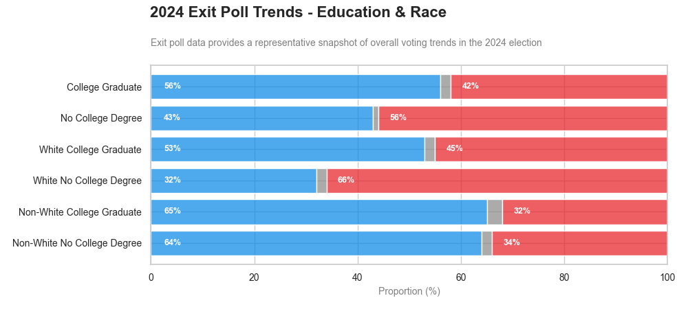
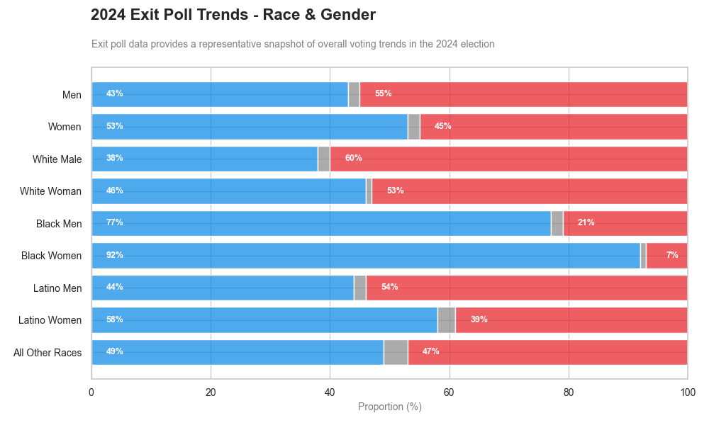
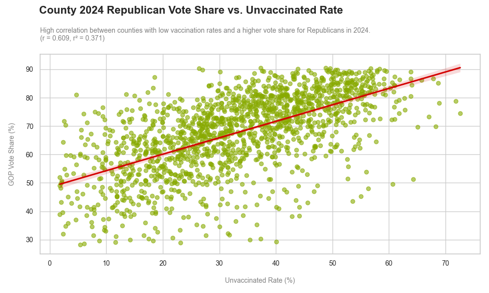
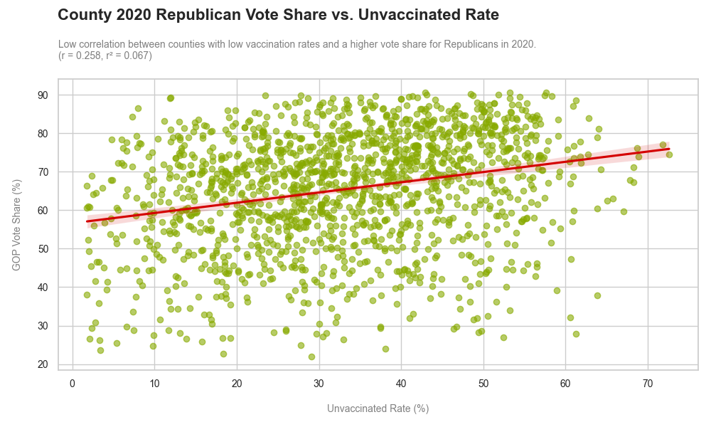
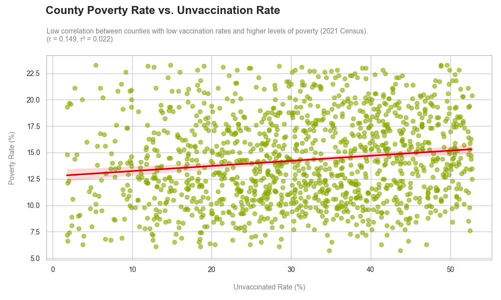
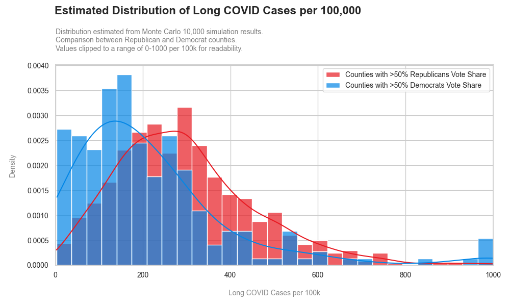

As a non-American observing America’s enthusiastic self-destructing, I find it utterly baffling that a man like Donald Trump could secure a second term. Over half the nation saw the individual who somehow achieved the rare feat of bankrupting not one but two casinos, which are famously designed to print money, as the best choice to lead the country. There's definitely something wrong with America right?

I've long entertained a personal pet conspiracy theory that COVID-19 has had a far deeper impact on Trump's re-election in 2024 than most realise. While numerous factors undoubtedly contributed to Trump's victory, this article specifically explores the subtle but significant role COVID-19 may have played.

My hypothesis revolves around the idea that COVID-19 exacerbated existing socioeconomic inequalities among marginalised communities, making them easier targets for disenfranchisement, whether intentional or accidental. This was compounded by targeted misinformation campaigns and systemic neglect, ultimately diminishing voter turnout among communities less likely to support Trump.

Although I initially approached this topic somewhat facetiously, the data aligned surprisingly well with my suspicion, compelling me to fully commit to this analysis.

In short: Did COVID-19 help Trump win the 2024 election? Probably. But you'll need to read on for the long answer.

## The Neoliberal Playbook: Disenfranchisement

To understand how COVID-19 may have materially influenced the outcome of the 2024 election, it is first necessary to grasp the role of neoliberalism in shaping contemporary American governance. This section serves as essential context for the remainder of the analysis.

Neoliberalism in the United States often manifests through policies that systematically disenfranchise those least likely to support conservative interests, particularly marginalised or economically vulnerable communities. This disenfranchisement is not incidental but is integral to the neoliberal project.

It typically takes the form of privatising essential public services such as healthcare and education, implementing austerity measures, concentrating decision-making in the hands of unelected technocrats (cough, Elon Musk), and deploying voter suppression tactics including gerrymandering and restrictive voter ID laws. These mechanisms, whether legal, procedural or administrative, function to erect barriers that disproportionately hinder political participation among already disadvantaged groups.

Understanding this deliberate strategy of exclusion is crucial; without it, the broader implications of pandemic-era policies on democratic participation cannot be fully appreciated.

### Undermining Education, Shaping Votes

Given the stark differences in voting patterns between college-educated and non-degree holders, it's unsurprising that Republicans consistently seek to defund public education[^3]. For instance, the 2024 Republican education bill proposed slashing $64 billion (28%) from education budgets, severely impacting critical programmes such as Title I funding, special education, and support for English learners.

This deliberate undermining of education cultivates a populace less capable of critically evaluating political information, leaving them more susceptible to emotional manipulation, political apathy, and anti-government sentiment. Conversely, research consistently demonstrates that improved media literacy education significantly boosts civic engagement and reduces political apathy[^5].

Statistically, lower education levels, particularly among White voters, correlate strongly with increased Republican support. This dynamic reinforces existing inequalities and pushes marginalised communities further towards political disengagement or manipulation[^4].

The relationship between education, race, and political alignment is stark: Non-White, college-educated voters overwhelmingly favour Democrats, highlighting education's strong correlation with Democratic support. In contrast, White voters without college degrees predominantly vote Republican, illustrating how education intersects significantly with racial identity to shape voting behaviours. This pronounced educational gap remains consistent across racial groups, underscoring education's pivotal role in shaping electoral outcomes.

Younger voters and voters of colour have increasingly become targets of Republican voter-suppression tactics. In North Carolina, Republicans contested over 65,000 ballots, primarily from college students, unsuccessfully attempting to overturn election results[^11]. Similarly, in Florida, Governor DeSantis's administration penalised voter-registration groups for minor procedural infractions, disproportionately impacting minority communities[^12].

### Making Voting Harder (For Some)

Rather than explicitly prohibiting voting, Republicans typically create logistical and administrative hurdles designed to discourage participation among voters unlikely to support them, effectively eroding democracy by attrition.

Black voters overwhelmingly support Democrats, and Latino voters also lean Democratic, although less decisively. Conversely, White men strongly favour Republicans, with White women also generally leaning Republican, albeit more moderately. Additionally, women across all racial groups consistently prefer Democrats, emphasising gender's significant influence on voting behaviour.

A particularly egregious example of Republican tactics is the SAVE Act. Presented as a measure to enhance election security, the Act demands documentary proof of citizenship, such as birth certificates or passports, in order to vote. This significantly disadvantages women who have changed their surnames following marriage, as well as transgender individuals whose documents might not reflect their current identity.

Approximately 69 million American women lack identification matching their birth names[^6], and more than half the population does not possess a passport[^7]. Consequently, voting becomes effectively paywalled, disproportionately impacting groups historically less supportive of Republicans.

Republican-led voter roll purges, justified by claims of preventing fraud, frequently remove thousands of legitimate voters. For instance, in 2024, Virginia Governor Youngkin’s administration purged over 6,000 voters, many of whom were later confirmed eligible. Despite initial legal challenges, the U.S. Supreme Court ultimately permitted this purge to proceed[^9]. Similar attempts in Alabama, however, were blocked for violating federal election laws[^10].

## COVID-19 and the 2024 Election

COVID-19 became a potent instrument of voter disenfranchisement, largely through the proliferation of disinformation campaigns[^13]. Social media platforms were inundated with misleading content, much of it specifically targeting communities of colour, sowing confusion around voting procedures and eligibility.

This phenomenon was not confined to the United States. In New Zealand, a similar dynamic unfolded when the rural protest movement Groundswell, originally formed to oppose regulatory and environmental reforms affecting farmers, began attracting support from individuals aligned with anti-lockdown and anti-vaccine ideologies. While these views were not part of Groundswell’s founding purpose, they increasingly found a platform within its broader protest activity, particularly during the height of pandemic-related restrictions.

At the time, the Labour Government had implemented stringent but effective lockdown measures. Groundswell received vocal support from the National and ACT parties [^15], and later also from New Zealand First. These three parties would go on to form the coalition government following the general election.

Thus, COVID-19 intensified existing inequalities, erected new voting barriers, and amplified targeted misinformation, significantly suppressing democratic participation in marginalised communities.

### Vaccinations & Voting

Political affiliation strongly influenced vaccination rates, with clear party divides: 92% Democrats, 68% Independents, and only 56% Republicans vaccinated[^14].

A distinct correlation emerged in 2024 data showing lower vaccination rates strongly associated with higher Republican vote shares. This relationship was notably absent in 2020, suggesting vaccination status became a politically defining factor between 2020 and 2024.

Interestingly, poverty levels did not correlate strongly with lower vaccination rates, countering the intuitive expectation that poorer counties would be less vaccinated due to education or resource barriers.

### Estimating Long COVID's Hidden Impact

This section ventures into more speculative territory. Data constraints limit firm conclusions, but my ~~conspiracy theory~~ general hypothesis includes:

- Republican-leaning counties, with lower vaccination rates, likely faced greater vulnerability to long COVID. Studies indicate vaccinated individuals experience significantly lower risks of developing persistent symptoms[^1].
- Long COVID symptoms (e.g., cognitive impairment or "brain fog") could further diminish political engagement, increase susceptibility to misinformation, and exacerbate socioeconomic disparities.

Due to limited county-level long COVID data, I've simulated potential prevalence using COVID case and vaccination rates. This simulation provides a structured estimate of how long COVID may disproportionately impact areas with low vaccine uptake.

Using Monte Carlo simulation, I estimated county-level long COVID prevalence based on COVID cases, vaccination status, and established risk factors. Running 10,000 simulations, outcomes were normalised per 100,000 residents and classified by political leaning. Results allowed comparison between Democrat and Republican counties, exploring how vaccination rates potentially influence broader political dynamics.

Republican-leaning counties exhibit distinctly higher estimated long COVID prevalence, suggesting a potential public health and socioeconomic divergence along political lines.

Although these estimates can't definitively prove long COVID’s electoral influence, they indicate it likely had some impact. Across counties analysed, around 500,000 long COVID cases were estimated, alongside a notable increase in Republican votes (approximately 2.5 million) between elections, despite incomplete data coverage.

## Conclusion

A fundamental rule of statistics remains: correlation does not equal causation. Nonetheless, the evidence strongly suggests COVID-19 played a substantial role in Trump's 2024 victory.

To summarise clearly:

- COVID-19 likely contributed, intentionally or not, to voter disenfranchisement.
- Low vaccination rates correlated strongly with Republican support in 2024, suggesting vaccination status became politicised.
- Republican counties, due to lower vaccinations, face higher long COVID risks and potential ongoing cognitive impacts.
- Political affiliation is more strongly linked with vaccination rates than poverty or education, although these may indirectly influence the situation.

If you disagree with my conclusions, please challenge them. While I believe my analysis holds water, constructive discourse is always welcome, and there is always a chance I have overlooked something crucial.

In short, COVID-19 just gave us one more reason to dislike it.

## Appendix

- [GitHub Repo](https://github.com/marzukia/covid-trump-analysis)
- [Exit Poll Demographics](https://www.nbcnews.com/politics/2024-elections/exit-polls)
- [2020 & 2024 Voting Data](https://github.com/tonmcg/US_County_Level_Election_Results_08-24)
- [County Level Vaccination Data](https://data.cdc.gov/Vaccinations/COVID-19-Vaccinations-in-the-United-States-County/8xkx-amqh)
- [County Level COVID-19 Data](https://covid.cdc.gov/covid-data-tracker/#datatracker-home)
- [County Poverty Data](https://data.ers.usda.gov/reports.aspx?ID=4040)

## References

[^1]: https://pmc.ncbi.nlm.nih.gov/articles/PMC10664948/ "Association between long COVID and vaccination: A 12-month follow-up study in a low- to middle-income country"
[^2]: https://www.nbcnews.com/politics/2024-elections/exit-polls "2024 Elections Exit Polls"
[^3]: https://democrats-appropriations.house.gov/news/fact-sheets/fact-sheet-house-republican-funding-bill-denies-education-and-training "FACT SHEET: House Republican Funding Bill Denies Education and Training Opportunities for Students and Job Seekers at All Stages of Life"
[^4]: https://files.eric.ed.gov/fulltext/EJ1151035.pdf "News Media Literacy and Political Engagement: What's the Connection?"
[^5]: [https://www.researchgate.net/publication/340394976*Media*...Social_Media](https://www.researchgate.net/publication/340394976_Media_Literacy_Dimension_in_Reinforcing_Political_Participation_Integrity_Among_Young_People_in_Social_Media) "Media Literacy Dimension in Reinforcing Political Participation Integrity Among Young People in Social Media"
[^6]: https://www.americanprogress.org/article/the-save-act-would-disenfranchise-millions-of-citizens/ "The SAVE Act Would Disenfranchise Millions of Citizens"
[^7]: https://today.yougov.com/travel/articles/46028-adults-under-30-more-likely-have-us-passport "Adults under 30 are more likely than older Americans to have a current U.S. passport"
[^8]: https://www.npr.org/2025/04/13/g-s1-59684/save-act-married-women-vote-rights-explained "Will the SAVE Act make it harder for married women to vote? We ask legal experts"
[^9]: https://apnews.com/article/north-carolina-governor-legislature-elections-board-auditor-44db0cb156c701577b9cb2d22b1d135f "North Carolina judges block GOP law to strip governor’s election board powers"
[^10]: https://edition.cnn.com/2024/09/29/politics/alabama-justice-department-election-lawsuit/index.html "Justice Department sues Alabama over its effort to remove more than 3,000 names from voter rolls too close to election"
[^11]: https://www.teenvogue.com/story/north-carolina-republicans-college-students-votes-election "North Carolina Republicans are Trying to Throw Out College Students’ Votes to Steal an Election"
[^12]: https://www.theguardian.com/us-news/2023/jul/13/florida-fines-voter-registration-groups "Revealed: Florida Republicans target voter registration groups with thousands in fines"
[^13]: https://theemancipator.org/2024/11/05/topics/technology/voter-suppression-2-0-how-digital-misinformation-targets-marginalized-communities "Voter suppression 2.0: How digital misinformation targets marginalized communities"
[^14]: https://www.brookings.edu/articles/for-covid-19-vaccinations-party-affiliation-matters-more-than-race-and-ethnicity/ "For COVID-19 vaccinations, party affiliation matters more than race and ethnicity"
[^15]: https://www.act.org.nz/act-mps-back-rural-new-zealand-at-groundswell "ACT MPs back rural New Zealand at Groundswell"
