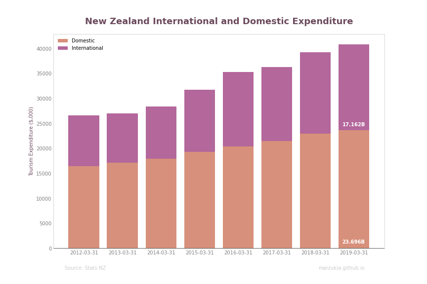
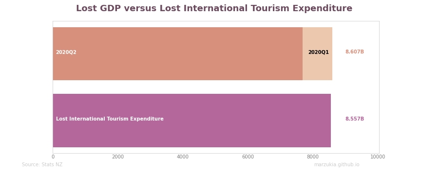

New Zealand has officially entered into a recession after 11 years following two consecutive periods of negative GDP growth. This last time New Zealand was in a recession was in 2008 due to the global financial crisis. Given the current circumstances, it's no surprise that this has occurred.

Given the proximity to the elections, it's also no surprise that many political parties have taken the opportunity to blast the incumbent government for their 'poor handling' of our COVID-19 response. I had a look at our recovery so far in my [previous post](https://marzukia.github.io/post/how-well-has-new-zealand-handled-covid-19/).

In my opinion, many news sources and political parties have significantly mis-contextualized the extent of how significant our recession has been.

## Headline Numbers

> **Recession**, _noun_, a period of temporary economic decline during which trade and industrial activity are reduced, generally identified by a fall in GDP in two successive quarters.

This visualization is something you may have seen frequently on the mainstream news sites. It highlights and shows our drastic fall into a recession. Without context, you'd be correct to be incredibly alarmed. U

Unlike other countries, New Zealand could quickly return to relative normalcy, so why are we still entering a recession?

## Tourism and GDP

On 19 March 2020, New Zealand closed its borders to almost all travelers, this in conjunction with our effective lockdown procedures, New Zealand got COVID-19 under control very quickly.

This border closure had an immediate effect, with our monthly arrivals plummeting to practically zero by the start of April. This sharp drop in overseas visitors significantly impacted New Zealand's tourism industry, which makes up a significant proportion of its economy.

In FY19 international and domestic tourism contributed $40.9B of expenditure into our economy; international tourism equaled $17.162B. The indirect and direct value of tourism was quantified to be a 9.8% contribution to our GDP.

## Contextualizing the Numbers

Let's contextualize the GDP graph from our 'Headline Numbers' section with the above in mind.

If we convert the graph from percentage to nominal terms, we can see that New Zealand GDP contracted by $922M and $7.685B for quarters one and two, respectively, this is a total of $8.067B in lost GDP.

At the time of writing, it has been 182 days since New Zealand closed its borders. We can pro-rata the value of FY19's total international tourism expenditure as our proxy for what we've lost by international tourism in FY20. This figure is $8.557B in lost expenditure.

I believe that our borders' closure was an essential step in getting our domestic economy to recover at the pace it has. The above graph shows that the recession New Zealand has entered was practically unavoidable.

Given our significant reliance on tourism, closing our borders would lead to the inevitable loss of foreign tourism.

## Conclusion

It's disappointing to see so many places do such shallow analysis of New Zealand's recession. Whether intentionally or negligently, reporting **NEW ZEALAND IN RECESSION** without doing the bare minimum to explain the context will lead to unnecessary panic in a time where it is certainly not needed.

This post is not aiming to downplay the significance of our country entering into a recession, but more to provide a level headed and pragmatic view of it considering extenuating circumstances at a macro level.

Lastly, I can't imagine a scenario where New Zealand does not enter into a recession during a global pandemic without seriously sacrificing its performance in managing cases. I would take the option where New Zealanders don't die en masse over one where we all make slightly more money.
