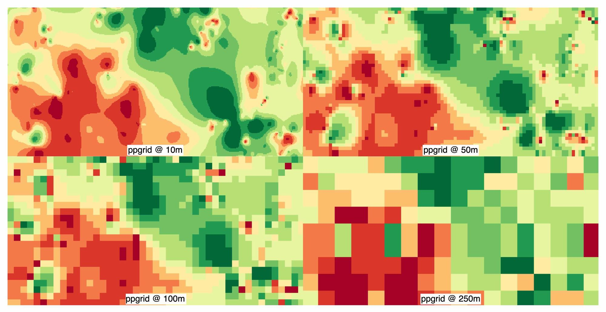
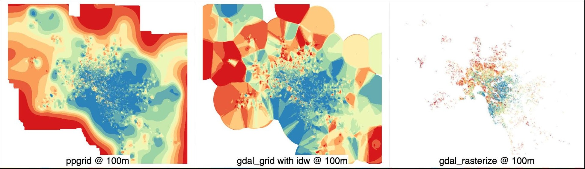
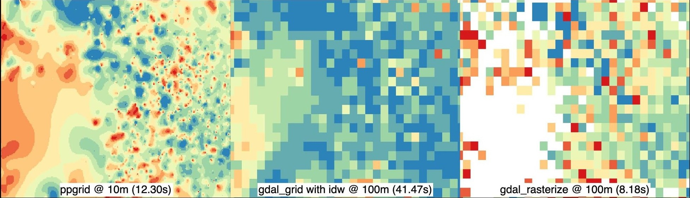

Have you ever been given tens of millions of rows of point data that you somehow need to visualise? Did you then leave ArcGIS/QGIS/GRASS running for a few days? If you answered yes to both of these, you are the perfect audience for this post and my new tool [marzukia/ppgrid](https://github.com/marzukia/ppgrid) - (there's literally dozens of us!)

I am a massive believer that visual storytelling is the key to being an effective data communicator; this is especially important when the data is dense or complex, as it often is with spatial data. I'm also a huge advocate of releasing the work that I do (where possible), as I think that the GIS ecosystem / community is generally too opaque and closed off. I touched on this a little in a [previous post](https://mrzk.io/posts/building-high-performance-spatial-apps/). I'm cognizant that the applicable audience for this post is pretty narrow; this post is about a very specific problem space that I often run into, and I freely admit it's probably one that not many people have.

In my opinion, storytelling with spatial data is far more effective than charts, as it allows the reader to visually anchor the data to a _physical_ place somewhere in the world; the map then inherits the subconscious context and knowledge of that physical place without any additional effort on my end as the storyteller. Visualisation of large spatial datasets is a core part of my day-to-day job and the side ventures/projects that I do. This is because I love what presenting data on a map does for a data story; it takes it from an abstract concept to something that is visually compelling.

---

 

## Problem Statement & Motivation

My core problem statement is that I often have to work with point data which may be tens of millions of rows in size, and existing tooling that is readily available is generally bad, slow, unperformant or all of the above. Without being too specific, I often have to visually demonstrate what this CSV containing 20M+ rows of various modelled risk data looks like on a map.

I basically want to be able to feed in a very large point dataset (containing coordinates and some kind of numerical value) and create a continuous raster that:
1. looks aesthetically pleasing; and
2. dynamically adjusts its resolution depending on the underlying point sparsity; while
3. not forcing me to wait for millennia to see my raster.

One very important caveat for any readers considering using this: my particular problem space is not reliant on the output raster files for calculations; the underlying point matrix data would be used directly. This solution is purely to make the visualisation element, which would otherwise be a pain in the ass to do, easy. Therefore, if your problem statement requires the spatial layer to be used for interpolation, please double-check the code and any statistical or computational implications.

For reader context, my traditional approach to dealing with this was to use a grid-bin style cumulative mean, which involved creating a cumulative sum raster divided by a cumulative count raster. While this generally worked, it left me with very sparse or ugly visualisations, especially when it comes to countries like Australia, where most of the country is sparse. Additionally, with this method we are limited to a single resolution; this means that grid sizes are far too small in regional areas, resulting in large patches of empty areas due to distances between points. Inversely, if we use a larger grid to cover sparse regional areas, the grid is far too large in dense urban areas. I've also often attempted to use inverse distance weighting (IDW) in the past as I really love how it looks; however, it's rarely ever worth me eating the compute time(s) required to actually use it.

Full disclosure, this is not my first attempt at trying to develop something to solve this problem - I have tried unsuccessfully multiple times. However, since I am now able to pair program with my local agent(s), the parts that used to stump me are now largely cleared as blockers. In particular, no matter how many times I've tried to learn linear algebra and calculus, my brain refuses to understand it. 

Embarrassingly, I thought I had come up with a novel way to achieve this goal, but it turns out I independently created a method that's existed for 3 decades, being Gortler et al. (1996), The Lumigraph. The paper's original problem space aimed to solve the reconstruction of missing samples across a multiresolution image pyramid (paraphrasing), which is essentially the same root cause as my ugly/patchy raster problem - how do you fill in the blanks?

**n.b.** I have adopted push-pull lingo as that's already established terminology and it'd be arrogant of me to claim otherwise. 

## Benchmarking & Usage (My Sales Pitch)

An M4 MacBook Pro with 24GB was used to do these benchmarks with a synthetic point dataset containing 100K points in the Melbourne area. Unfortunately, the true side-by-side benchmark is limited to only 100m res, as my attempts to run `gdal_grid` at a 10m resolution resulted in my laptop attempting to self-destruct.



`gdal_grid` takes 20x more time than `<em>ppgrid</em>` to process the synthetic dataset, whereas my old approach took approximately 4x the time. This is again because traditional IDW uses `O(M * N)`, which means at 100m, it must make a significant amount of extra effort to do the same job as `<em>ppgrid</em>`. My old approach isn't too unwieldy, but as you'll see shortly, the output is not super pleasing to look at. 

---



To really reinforce my point, look at how the time taken to process the dataset changes as the number of points increases. With `gdal_grid`, there is a 50x increase in the time taken to process 100K vs 1K. `<em>ppgrid</em>` remains flat irrespective of the number of points as it does not multiplicatively scale.  

---

<em>ppgrid</em> creates the most visually attractive imagery, in my opinion, and avoids the nasty Voronoi-esque polygons that start to appear at the edge of IDW outputs. My old approach using a cumulative mean via binned grids is extremely patchy as soon as data becomes sparser.

---

I'm being a little cheeky here with this comparison as I'm comparing oranges with apples; however, the point I am trying to make here is that at roughly the same cost as using `gdal_rasterize`, you can achieve a much higher fidelity raster file without all the horrible gaps in data.

## How It Works

<em>ppgrid</em> is a close cousin (or could even be a half-sibling) to a traditional implementation of inverse distance weighting (IDW) with one major difference: instead of calculating the full distance-weighting kernels directly, we use a pull-push approximation of what the value should be for any given cell.

Simplistically, IDW becomes so unwieldy as its execution requires you to calculate the total number of points multiplied by the total number of output cells in your output raster (`O(M * N)`). This means that as the resolution and/or the number of points increase, the computational effort required becomes more unreasonable. For example, one million points and one million output cells would require up to one trillion point-to-cell comparisons in a naive implementation.

Pre-binning the points to individual cells (`O(N)`) means that we can create an upper limit on how much subsequent computational effort is required, irrespective of the number of points, in exchange for some loss in spatial precision. This means that even as the number of points and output cells increase, computational effort remains linear as opposed to growing multiplicatively. <em>ppgrid</em> also constructs a mipmap pyramid to provide coarser estimates where local data has less support; ultimately, this means that we are now doing `O(M) + O(M/4) + O(M/16) + O(M/64) + ...` instead of `O(M * N)`.

The mechanical execution breaks down to the following:

1. Create two grids:
    - Assign each point into a cumulative sum grid called `S`
    - Assign each point into a grid called `C`, then count the number of points
2. Conceptually, grid-based IDW spreads both grids outwards, with nearby cells having more influence than cells further away. Influence is defined by `K(r) = r^-p`, where `r` is the distance from a point and `p` is the factor which describes the level of influence decay being sought. A `p` of 2 would mean that a point twice as far as another would have only a 0.25 weighting.
3. Dividing the distance-weighted value total by the total distance weight produces the interpolated average (`(S ⊛ K) / (C ⊛ K)`). <em>ppgrid</em> approximates this process through the pull-push pyramid rather than calculating the kernel directly.
4. This process uses repeated `2 × 2` block sums to create increasingly coarse layers, which is done so a mipmap pyramid can be created providing a dynamic support scale. Where data density is high, estimates rely on the fine local grid, but as data sparsity kicks in, the coarser layers provide decreasingly confident estimations of what the value would be without ugly gaps in the raster.
5. <em>ppgrid</em> then runs backwards, pushing the coarse estimate down through the pyramid and blending it with local information at every level. Each point is binned once and everything after that works on raster cells, which makes point loading `O(N)` and the pyramid roughly `O(M)` rather than repeatedly combining both costs; that change is where almost all of the performance gain comes from.
6. The pull phase reduces the fine grid into coarser levels, but the sum and count grids must remain separate because averaging at every level would give a cell containing one point the same weight as a cell containing one thousand points, which is obviously wrong. Carrying the sums and counts separately preserves the weighted mean throughout the pyramid.
7. The push phase starts at the coarsest level and upsamples that estimate into the next finer level, with the local estimate and parent estimate being blended using a simple confidence value: `confidence = min(count / saturation, 1)`.

Saturation acts as a metric of how much a cell can trust the data it contains; when there are sufficient points in a grid, it does not need to inherit from its parent. However, when cells have fewer observations, they will begin to lean more heavily on broader estimates from coarser layers. Upsampling also applies a small bilinear-style smoothing filter because nearest-neighbour upsampling leaves square pyramid boundaries everywhere, which already looks bad in a raster and becomes even worse after vectorisation when the visual artefact turns into a real polygon edge.

## Quality of Life & Explicit Design Decisions

As I've already mentioned, <em>ppgrid</em> is essentially IDW with some extra steps, so the fundamental issues with IDW remain relevant here. Since <em>ppgrid</em> is an operational part of my day-to-day toolkit as opposed to a pure experiment, I've made certain design decisions which are aimed at making it as easy as possible for me to get these rasters into a usable state for my various projects and applications. Because my primary objective is to create rasters for visual representation as opposed to spatial operations, some decisions may not be as spatially accurate as you would get with a traditional IDW or cumulative mean binned grid approach. 

**n.b.** I've omitted uninteresting decisions.

### Maximum Radius / Fill Distance Limiting

Without an appropriate guard rail, the coarsest level would happily (and likely erroneously) invent a value to fill the entire raster. While this value may be deterministically derived, it is useless as an estimate because it could be using points from hundreds or thousands of kilometres away. So just like IDW we have a fill distance limit, however, unlike the pull-push estimate itself, where distance is represented indirectly through the pyramid, <em>ppgrid</em> applies an explicit fill radius using the count grid and a summed-area table to determine whether at least one valid data point exists nearby.

### Support Raster - Spatial Scaling

As with all interpolated rasters, the calculation used to derive a given pixel's value is hidden. This means that two neighbouring cells may appear equally authoritative, even though some cells may have a high level of saturation, meaning their true derived values are used, whereas a neighbouring cell may have inherited an estimate from a coarser layer due to sparsity of data. The end result is a dangerous situation where data may appear correct while actually being very wrong. To address this, a support raster is created as part of the output which records the effective spatial scale behind each estimate; smaller values mean local evidence strongly supports a given pixel's value, whereas large values indicate it has borrowed the estimate from a coarser layer.

### Preflight Calibration & Percentile Raster Output

Raw values can be terrible interpolation inputs, especially for skewed datasets such as house prices, insurance losses and environmental measures, where a few extreme values can dominate the entire surface. <em>ppgrid</em> tests identity, log10, square-root and percentile transforms, then uses intraclass correlation to select the transform where location best explains the variation.

<em>ppgrid</em> also calibrates the fill distance using spatially blocked cross-validation. Random cross-validation is rubbish for clustered data because a held-out point may still be metres from a training point, which gives an impressive score while proving almost nothing. Instead, <em>ppgrid</em> holds out whole areas and finds the furthest support distance that still beats a simple mean. The selected transform, fill cap and percentile lookup table are then saved to `calibration.json`.

The output itself is returned as a percentile rather than raw values (which can be restored via `calibration.json`). This means every dataset has the same 0-100 range, allowing the result to fit neatly into an int16 GeoTIFF; the default encoding is `percentile = DN / 100`, so a stored value of 5000 represents the 50th percentile. This is a pretty opinionated design decision, and I have two straightforward reasons for this: 

1. I often need to vectorise the raster to work with my project limitations (and serve via MVT); and
2. percentile output allows me to round to a whole number to make polygonisation brain dead and I am not relying on the accuracy of the raster itself, it is for visual purposes only.

## Closing

As always, the source code is on [GitHub](https://github.com/marzukia/ppgrid) and the package is on [PyPI](https://pypi.org/project/ppgrid/), so try it on something unreasonable and tell me where it breaks. I encourage you to give it a try if it's relevant to your use case and contribute if you think you can improve it. The repository includes 13,580 Melbourne property sales, with dense inner-city observations and much sparser outer areas that give the pyramid something interesting to do.

My big focus with <em>ppgrid</em> to date has been on getting visually aesthetic and mostly correct rasters that can be generated quickly; this goal, I believe, I've largely achieved. In terms of future work, the key things I'll look to be doing will largely anchor around spatial correctness and statistical soundness. This is specifically if I need to use the rasters beyond visualisation, such as actually trying to interpolate points where the value is an estimate. As such, my key areas of focus will be:

1. A proper comparison and analysis between exact IDW and other interpolation methods across different spatial fields, covering both visual quality and actual predictive performance. The biggest blocker is that I am yet to find a computationally acceptable method of generating rasters with a lot of points; that means that any analysis would be smaller in scale, which is obviously less desirable.
2. I also want to look at how I can further tune performance, as some processing steps feel like they could have room for improvement. This is a gut feel as opposed to something I've assessed.
3. Dogfooding <em>ppgrid</em> with global extents and awkward coordinate systems, as my focus has largely been at a country scale and the quirks of global-scale datasets haven't really been addressed.

As of right now, I would consider this to be an alpha release. 

Lastly... if <em>ppgrid</em> has helped you out, please reach out and let me know - I would love to hear it. 
