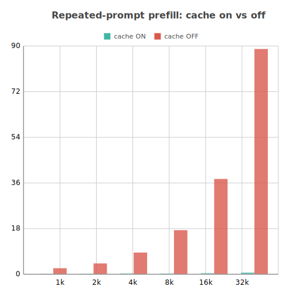
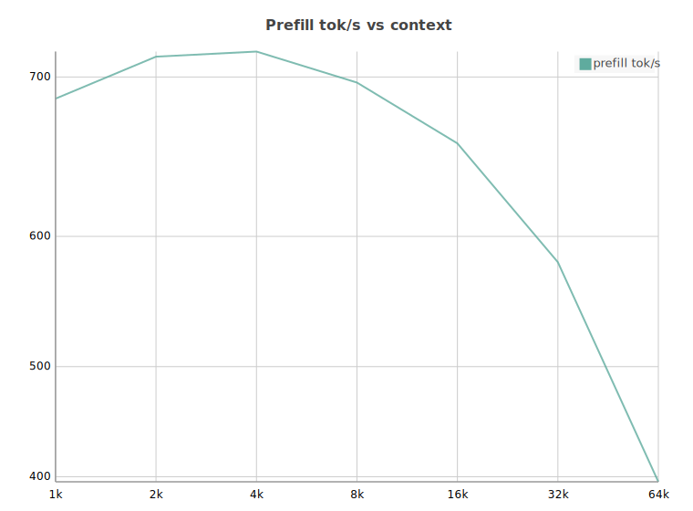
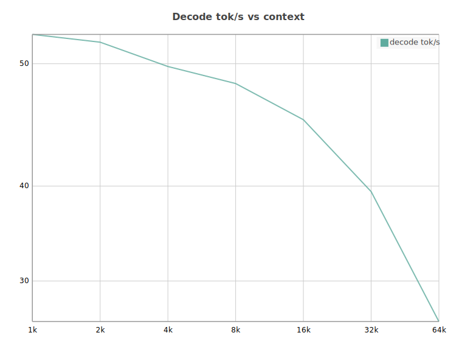
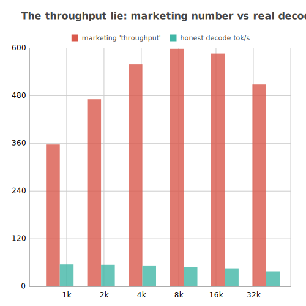

A follow-up question on a 50,000 token conversation took three to five minutes before the first token appeared. Not the full answer. The first token. That is not a chatbot, it is a batch job, and you go and make a cup of coffee while it thinks.

To the dozen other geeks obsessed with maximising your Mac Studio, I come with good tidings. By good tidings I mean I spent three weeks debugging a cache leak so you don't have to.

This started with [antirez/ds4](https://github.com/antirez/ds4), a brilliant experiment in running large models on consumer hardware. Two months ago I impulse-bought an M3 Mac Studio Ultra. I feared RAM prices would make the 96GB configs unattainable soon (spoiler: they did), and I really wanted to dive into local inference stacks whilst I am on parental leave. The goal was simple: run a frontier model on a single machine, keep it warm, and have a conversational AI that actually understands context.

It turned out to be more complicated than that. The model fits in unified memory and answers coherently, But after weeks of daily use I made a hard pivot: I dropped DS4 Flash and switched to Qwen 3.5 122B. Two separate things then happened, and it is worth keeping them apart. The model swap was a speed-and-fit decision. Making the new model actually usable meant fixing three bugs in my own serving stack that had nothing to do with which model I ran.

## Why I switched models

DS4 Flash is a genuinely good model and antirez's stack is a brilliant piece of work. It just was not the right model for what I do. This is a fit story, not a fault story.

My use case is long-context agentic coding: pair programming where the model holds thousands of tokens of conversation, code, and tool output, and I need near-instant turns to stay in the flow. For that specific workflow the prefill latency was the dealbreaker. Past 50k tokens a simple follow-up took three to five minutes before the first token appeared, and you cannot pair program with a model that makes you wait for a cup of tea. By the time it caught up I had already moved on to the next problem. That is not DS4 being slow in some absolute sense, it is a mismatch between how that setup handles long-context prefill on my hardware and what my workflow needs.

Qwen 3.5 122B looked like a better fit for the M3 Ultra on every axis I cared about:

*   **Near frontier, fully local.** No API calls, no rate limits, no data leaving the machine. A 122B model that rivals proprietary systems, running entirely offline.
*   **The right active-param size for the Ultra's bandwidth.** The M3 Ultra's memory bandwidth is large. A 122B MoE with roughly 10B active params sits in the sweet spot where the GPU can feed the compute units without stalling.
*   **A good balance of tool calling and reasoning.** Enough reasoning depth for complex code logic, robust enough for reliable function calling and agent orchestration.
*   **The right size for a unified KV cache.** With 96GB of unified memory, a 122B model at low bit-width leaves just enough headroom for a deep SSD-backed KV cache, which is the whole game for long-context retention without swapping.

The closest serving stack I could find was `rapid-mlx`. But it went a different direction on hybrid attention. Given that divergence, I forked it instead. The result is [qMLX](https://qmlx.mrzk.io), available on [GitHub](https://github.com/marzukia/qMLX). The fork is specialized for hybrid attention (more on that at the end).

## The real work: killing three bugs

The model fits, but it was unusable out of the box for a different set of reasons that had nothing to do with the model itself: every follow-up message reprocessed the entire conversation from scratch. On a 130k-token context that is a multi-minute wait before the model emits a single word.

The cause is the hybrid attention architecture, a mix of GatedDeltaNet (SSM) layers and dense attention. The recurrent state in the SSM layers cannot be rewound or trimmed to an earlier position, so to avoid a memory leak the in-memory cache drops any entry containing those layers. For this model the in-memory prefix cache misses every single time. In a normal window I measured zero in-memory hits against 109 disk hits. The only thing keeping the model warm is the disk cache: checkpoint the attention KV to SSD, restore it on the next turn. Disk restore is not a fallback here, it is the entire cache. And it kept breaking, in three separate ways, each hiding behind the last.

### Bug one: a timestamp in the system prompt

KV reuse is byte-exact. If the prompt changes even slightly, the match fails at the first difference and everything after it recomputes.

The agent framework was stamping a unique message ID into the system prompt on every turn. That unique value, near the top of a 130k-token prompt, meant the prompt was never byte-stable. Turn two differed from turn one within the first few hundred tokens. The cached agent got thrown out, the whole system prompt rebuilt, and the match diverged early. Every turn, cold.

The fix was to delete the line. The message ID was decorative, nothing read it back, and the agent already had the ID through the per-turn user message. Nothing unique-per-turn belongs in the cached prefix. Put it in the part of the prompt that is supposed to change.

### Bug two: the reply that never happened

System prompt fixed, and it held for a while, then broke again deeper in the conversation.

When you send a message whilst the model is still replying, the agent interrupts the run. Correct behaviour. But on the interrupt path it broke out of the loop without saving the reply it had already streamed. The inference server had already decoded those tokens into its KV cache, but the history was missing the assistant turn. Divergence, deep in the body, cold fill.

I proved it against the database: four of my messages stored back to back with no assistant turn between them, and a reply that had visibly streamed to the screen simply absent from history. It was never written. The fix persists the streamed reply on the interrupt path before breaking, the same recovery the code already did for a dropped network stream. As a bonus, the agent stops forgetting things it said.

The general rule: if a generation's tokens can reach the server's cache, that generation has to be committed to history on every exit path, including the messy ones.

### Bug three: poison in the checkpoint store

After the first two fixes the cache held warm for turn after turn, then dropped cold exactly once on any turn that used a tool or got interrupted, then recovered.

Two writers touched the checkpoint store. One wrote the real thing: a checkpoint keyed to the prompt, the one the next turn restores from. The other was a background hook writing a full checkpoint every 256 generated tokens, with no token key attached, so it could never be matched or restored. Dead weight. And it counted against the disk cap.

A long tool-using turn generates a lot of tokens, which triggers a lot of those junk writes, which pushed the store over its cap, and the eviction policy dropped oldest-first, taking the one good checkpoint down with the junk. On disk at the time: 27GB of unmatchable bodies in a single directory, crowding out the checkpoints that mattered. The fix teaches eviction to drop the unmatchable checkpoints first, and gates the junk writer off entirely when restore is on. The good checkpoint survives, the next turn restores it, and the cold fills stop.

## Where it landed

Same conversation that used to cold-fill 30k tokens on every turn, after the fixes, growing from 31k to 57k tokens:

```
uid=58 HIT cached=53267 prefill=670
uid=59 HIT cached=54009 prefill=33
uid=60 HIT cached=54113 prefill=1671
uid=61 HIT cached=55867 prefill=45
uid=62 HIT cached=55996 prefill=1869
```

Every turn restores the prior context and prefills only the new message. Sub-second where it used to be minutes. The checkpoint directory settled into a clean state, every checkpoint matchable, no junk.

The cache does not just help, it changes the shape of the problem. Here is the same repeated prompt with the cache on and off, prefill time in seconds, lower is better:



With the cache off, a repeated 32k-token prompt still costs 88 seconds of prefill every single time. With it on, 0.64 seconds. The green bars are there, they are just flat against the floor. That gap is the entire point of the disk restore subsystem, and it grows with context: 13x faster at 1k, 137x at 32k.

Every number in this post comes from one machine: a Mac Studio with the M3 Ultra, a 28-core CPU (20 performance and 8 efficiency), a 60-core GPU, and 96GB of unified memory, running macOS 26.4. That is the only spec qMLX has been tested on. I have not run it on a binned Ultra, an M-series without the Ultra bandwidth, or a different memory config, so treat the thresholds here (the guard sizing, the shape of the decode curve) as specific to this box until someone reproduces them elsewhere.

Here is what the raw hardware does across context length, prefill throughput and decode throughput measured separately:





Prefill peaks around 700 tok/s at short context and tapers to 386 by 64k as the attention KV grows. Decode slides from 55 tok/s to 28. That decode curve is the visible cost of the 25% of layers that are dense attention: each generated token re-reads the whole KV cache, and that read grows with context. The 75% that are DeltaNet carry constant-size recurrent state and do not slow down at all, which is exactly why the drop is a gentle 2x over a 64x context increase instead of a cliff. The hybrid design is not a compromise here, it is the thing keeping long-context decode usable.

One rough edge, because this is an alpha and I would rather flag it than hide it. Before installing a restored cache there is a memory-headroom guard that estimates whether the dequantised KV will fit in available memory. It is currently far too conservative: it over-estimates the transient dequant footprint and leaves a wide margin below the physical limit on top, so it refuses restores that would actually have fit. I have turned it off by default for now, and it needs a proper rework to size the estimate honestly. The safety instinct is right, a restore that genuinely will not fit should be refused, but the current numbers cry wolf.

## Honest numbers

One more thing, because it is a small point of pride. When I built the metrics for this I refused the usual throughput lie: total tokens divided by wall time, which folds the near-instant prefill into the number and makes a slow decoder look fast.

Prefill and decode are different phases and I measure them separately. Decode tokens per second is generated tokens over the decode window only. Prefill throughput excludes anything served from cache, because the cache did not compute those tokens, it skipped them. The rule I held the whole surface to: any number that rises when you send a longer prompt at constant decode speed is lying to you.

The cache-hit number that actually matters on this model is the disk restore hit rate, since the in-memory cache is structurally dead. That is the one on the front of the dashboard.

Which brings me to the number I refuse to print without a warning label. Here is the "throughput" a benchmark would put on a slide, tokens processed plus generated divided by wall time, next to the decode rate you actually feel:



The red bar says 350 to 600 tok/s. The green bar, the one that governs how fast the reply actually streams to you, is 28 to 55. The red number is not so much wrong as meaningless: it rises the moment you send a longer prompt at constant decode speed, because it is dominated by prefill tokens that land almost instantly. Send a 46k-token prompt, generate 128 tokens, and you can advertise 500 tok/s whilst the user watches text appear at 38.

The number that actually matters in a conversation is neither of those in isolation. Because the cache makes prefill effectively free on warm turns, sustained conversational throughput is just the decode rate: roughly 55 tok/s at short context, holding around 28 even at 64k. The cache is what lets me quote the honest number and still sound fast.

That "effectively free" needs one honest qualifier, because restore is not the same as free. On a deep turn the cache serves 99% or more of the prompt straight from SSD, so time to first token tracks the delta, the new tokens since the last checkpoint, not the whole prompt. Sitting at 168k tokens, a short follow-up is 67 new tokens and 2.6s to first token, the other 168,373 come off disk. But that delta is still prefilled at full cost, and at this depth each new token has to attend over the entire 165k KV, so it runs about 10ms a token. A one-line question stays fast. Paste a big tool result or a file, 1,800 new tokens deep in the conversation, and you are back to 17s before the first token. Restore kills the cold-prefill cliff. It does not make deep-context prefill free: the deeper you are, the more each delta token costs.

## Design principles

A short list, because most of the decisions above fall out of it.

*   **Built for the Mac Studio, not portability.** Optimise for Apple Silicon and unified memory. No abstraction tax to keep a CUDA path alive.
*   **Hybrid attention and DeltaNet are first-class.** Recurrent state cannot be trimmed like a KV block, so the cache path handles it explicitly instead of pretending it is KV-only.
*   **SSD cache streaming is a first-class tier, not a fallback.** Unified memory is scarce, so reusable context lives on NVMe and streams back rather than being hoarded in RAM.
*   **Specialise for the models you run.** Qwen-first. Breadth is a cost, not a feature.
*   **Honest about the concurrency profile.** Single user, one sequence. A component that earns zero hits gets deleted, not tuned.
*   **Correctness beats cleverness on the cache path.** A wrong restore does not throw, it corrupts. Verify the token blob byte for byte, quarantine bad checkpoints, and prove changes on real traffic.
*   **Measure on the real box.** Numbers from an M3 Ultra with real models, not CI that cannot load a 122B.
*   **Lean by default.** Minimal dependencies, no cruft.

## qMLX and the tools

Everything above ships. qMLX is my fork of `rapid-mlx`, specialised for the hybrid Qwen 3.5 and 3.6 models on Apple Silicon, with the disk-KV-restore subsystem the whole post is about. None of it would exist without [raullenchai/rapid-mlx](https://github.com/raullenchai/Rapid-MLX). The base engine, the OpenAI and Anthropic API surface, and the MLX serving path are all theirs. qMLX only adds the hybrid-aware disk restore, the eviction and metrics work, and the Qwen specialisation. Thanks for the foundation to build on.

Before settling on `qMLX`, I ran a very short, very serious naming round that produced three candidates I am glad to have killed:
*   **QweMLX** (pronounced "Q-MLX"): Sounds like a typo.
*   **Qwengine** (pronounced "Q-engine"): Sounds like a plumbing supply.
*   **q-ml**: Too close to the existing `mlx-lm` and impossible to search for.

The winner, `qMLX`, is at least pronounceable and distinct enough to grep for.

*   **qMLX** ([marzukia/qMLX](https://github.com/marzukia/qMLX)): the fork. Disk KV checkpoint and restore, the matchable-aware eviction from bug three, hybrid-cache-aware accounting, and the honest metrics surface.
*   **The benchmark tool** (`bench_qmlx.py`, in the repo): the pp/tg sweep behind the charts above. It hits the running server with unique prompts so the cache cannot fake the prefill number, phase-splits prefill and decode honestly, and has a compare mode that runs each context size cold then warm to show exactly what the cache does. Rerun it against your own box.

If you are running a hybrid MoE on a Mac and fighting cold prefills, the three bugs above are the first places I would look.

## The verdict

None of this is a knock on DS4 Flash. The stack is a brilliant piece of engineering, and it proved you can run massive models on consumer hardware. It just was not the right model for my particular workflow.

Qwen 3.5 122B is the one that fits it. After killing three gnarly bugs it is fast and stable enough for daily long-context pair programming, which is all I was ever after. That is the alpha.

---

*Graphs made with [charted](https://github.com/marzukia/charted), my zero-dependency Python charting library, btw.*
