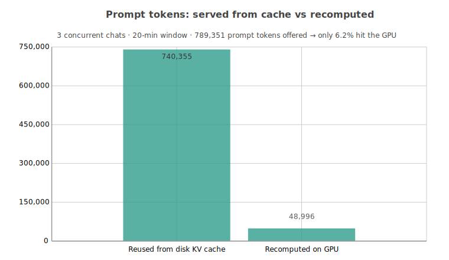
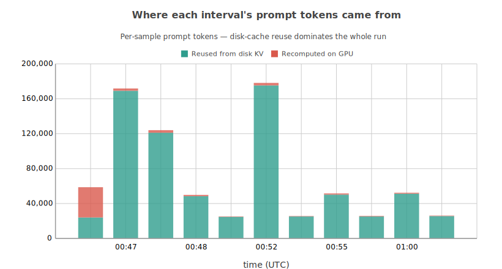
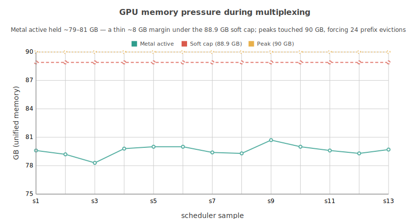
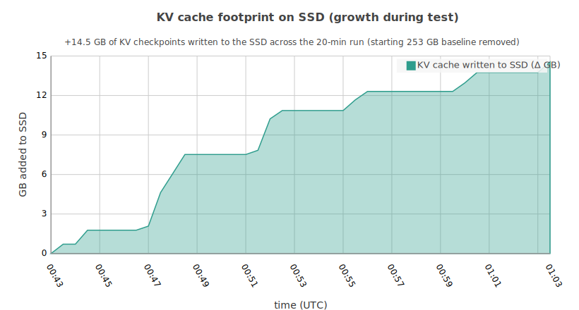
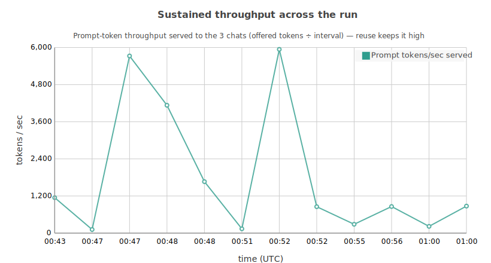

I recently wrote about my custom fork of `rapid-mlx`, [qMLX: Maximising my AI psychosis by minmaxing my Mac Studio](https://mrzk.io/posts/qmlx-maximising-ai-psychosis-minmaxing-mac-studio/), in a post last week. It honestly received way more traction than I was expecting so I've decided to keep a technical diary going forward which I'm going to call "Dogfood Tales".

With only two weeks out of my ten weeks of parental leave remaining I am now on borrowed time to push this project as far as it can go. Rather than winging it like I have up until this point I've decided to keep notes every time a noteworthy (read: annoying bug) happens as I use qMLX. My hope is that if I'm unable to spend much time on this project as work creeps back into the picture, some other person can continue the dream.

This post will cover off the three primary areas of concern I've identified while dogfooding qMLX over the last week:

- Leveraging qMLX's deliberate design principles (serial processing) and only using SSD KV cache restores to maximise multiplexing capability
- Experimenting with 3.7bit quant and pushing Qwen3.6 to the largest context on a 96GB Mac Studio that is stable
- Screaming about my cache being invalidated because the harness has reordered system prompt blocks (harness complaints)

_**tl;dr:** I have completely removed the hot cache path, and made qMLX a-restore-from-SSD inference engine that limits requests in a serial manner. qMLX can now achieve concurrency without parallelism, which finally lets me run sub-agents off a local model._

## Checkpoint Splitting & Enabling Multiplexing

As of [PR#27](https://github.com/marzukia/qMLX/pull/27) I've made the rather opinionated decision to rip out hot caching from qMLX. With only 96GB unified on my Mac Studio, it just seems entirely wasteful to use scarce RAM on maintaining a hot cache. For my particular use case which is agentic workflows, moving to a cold cache has basically meant I can expand the number of sessions that I concurrently run by simply expanding my disk space. Unlike RAM, disk space is essentially dirt cheap.

Until recently, I have been limiting my interactions with qMLX to a single session at a time to make it easier for me to isolate issues - with the majority of the core bugs resolved, I wanted to set my sights on "concurrency", this is mostly due to the fact that the bandwidth limitations of Apple Silicon mean things like continuous batching don't generally help [citation needed]. So the approach I decided to implement is the opposite of continuous batching, multiplexing.

As I dogfooded qMLX with multiple concurrent sessions, I continued to get wedged requests that basically grind everything to a halt. On the rare occasion, this was due to things like thought loops, but by far the biggest culprit was having to do an entire cold prefill on 100K+ tokens.

The culprit of this was my rather aggressive LRU evictor, it would reduce the qMLX's cache folder to 80% by basically removing the oldest/least used checkpoints. This was a problem born as a consequence of my own stupidity and short sightedness, as part of the initial POC I didn't bother optimising the checkpointing - I instead bruteforced the situation by using a TB5 2TB NVME enclosure (lol).

But the reason why any of this was an issue at all was the fact that Qwen3.5 122b uses Gated DeltaNet for its KV caching, this means that it can't be split cleanly like SoftMax attention (for example) could. That means that rather than creating incremental checkpoint slices, qMLX was checkpointing the entire state every time it hit the default threshold of 256.

Luckily for me, I've already opened the pandora's box of maintaining my own fork of an inference engine, so this problem was entirely solveable. The recurrent portion of Qwen3.5 122b's KV cache is _not_ splittable, but the remaining full attention layers can be split like any other KV cache. I'm also happy to say that it worked fantastic and has been implemented as of [PR#37](https://github.com/marzukia/qMLX/pull/37).

### The Results

If I could summarise the results in a few words, they'd be _"pretty sick"_. The changes have basically meant I am now able to host practically an infinite amount of concurrent sessions and use them all through multiplexing. This is particularly huge for me as I can now leverage sub-agents and sub-sessions, with a cheap cloud frontier model like MiMO V2.5 Pro I can make it do all the heavy lifting with my local Qwen3.6 122b.

To illustrate this in action, I ran three concurrent sessions and measured the outcome. Across the 20-minute test, 789,351 prompt tokens were offered to the model. Only 6.2% were recomputed on the GPU, the rest were restored from the on-disk KV cache.

Interval by interval, disk-cache reuse dominates recompute, the multiplexer keeps every conversation's prefix warm, so new turns extend cached KV instead of prefilling from scratch.

Since requests are pinned to run serially, memory pressure remains completely under control throughout the tests. Unified Metal memory sat steadily around 79-81 GB, a thin ~8 GB margin under the 88.9 GB soft cap. Brief peaks to 90 GB triggered 24 prefix-cache evictions: the system runs hot but never OOMs.

Pre-PR#37 running 3 concurrent sessions would have been excessively more. I had calculated that even with a 2TB size limit, I would only be able to host ~18 sessions. On-disk space utilisation still needs a bit of a tune up, and can be further optimised but there are bigger fish to fry. This is purely the growth during the test: +81 KV checkpoints written as new conversation states were snapshotted for later reuse.

Prompt-token throughput served to the three chats. Because most tokens come from cache, effective throughput stays high without three GPUs' worth of compute.

_n.b. I generally don't like using throughput as my metric, but in this case it seems somewhat appropriate._

### The Conclusion

* The cache did its job (and did it well). 789,351 prompt tokens were offered; only 48,996 (6.2%) were actually computed on the GPU. That's a 16.1x reduction in prefill compute.
* 30/32 KV restores hit; 30/32 prefills were "extend" (continue a cached conversation) rather than cold. Reuse didn't decay as the three chats interleaved, the win holds under contention.
* While multiplexing now enables concurrent sessions, the VRAM memory wall still exists and is a challenge, I can't push past an effective/stable context of ~200K.
* It's no way near as fast as cloud providers, but I am beyond overjoyed that I have a feasible way to use a fleet of Qwen3.5 122b workers with ONE Mac Studio!

The multiplexer turns three chats into roughly one GPU's worth of compute by serving 93.8% of prompt tokens from cache. It scales on memory headroom and KV-cache hit-rate, not raw FLOPs, so the knobs which remain "crankable" are better cache eviction policy and disk-restore latency.

### Other Diary Notes

_n.b. I was going to go in more detail with these but I spent too long writing the KV cache eviction BS._

### Observations About Lower Bit Models

One of my overarching goals is to get 262K context with Qwen3.5 122b but the fact I only have 96GB ram is the primary wall that I am facing right now. One of the avenues I looked into was using a 3.7bit quant of Qwen3.5 122b, however, I ran into two problems which pretty much made this a dead end for me:

- I ran into multiple occasions where the model just repeated the same word over and over (this never happened in 4bit).
- It still didn't get me to a stable 262K, transient spikes at ~230-240K still caused me to go OOM.

**Verdict**: No easy win here for me sadly.

_n.b. I'll have another post next week exploring my attempts to actually optimise prefill and implement usage of TurboQuant in qMLX._

### What the Hell is Wrong with Agent Harnesses

Sometimes, I find myself coding with my pair AI agent uninterrupted for days on end, not a cache break in sight. Unfortunately, I then wake up from my dream and realise that every single well-known agent harness out there at the moment is riddled with bugs that reorder, inject, strip or otherwise invalidate my prefix caching.

I absolutely did not want to manage my own agent harness, but I am now finding myself having to soft fork these bloody things because nobody seems to give a toss about keeping your prompts stable!! I can't be the only one livid about this?

As of writing, I am now using `kimaki` and I have made it stable in my own fork, but even then there's a bunch of other things I need to resolve (e.g. session IDs) to make my local multiplexing dream a proper reality.

## Closing

I am very pleased with progress made this week, and with my follow up post next week I'll talk through my attempts at boosting prefill and cache sustainability and efficiency. I think I'm not too far off of hitting my objective which would mean this is probably pretty close to being a beta state as opposed to alpha.

If anyone wants to chip in and help, please do so: https://github.com/marzukia/qMLX.

---

*Graphs made with [charted](https://github.com/marzukia/charted), my zero-dependency Python charting library, btw.*
